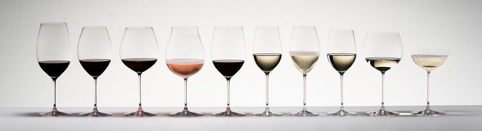
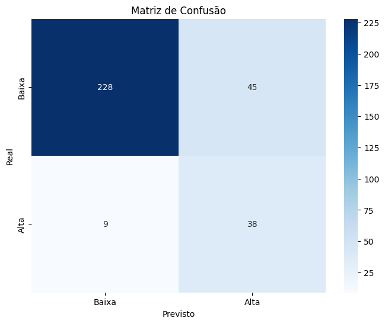
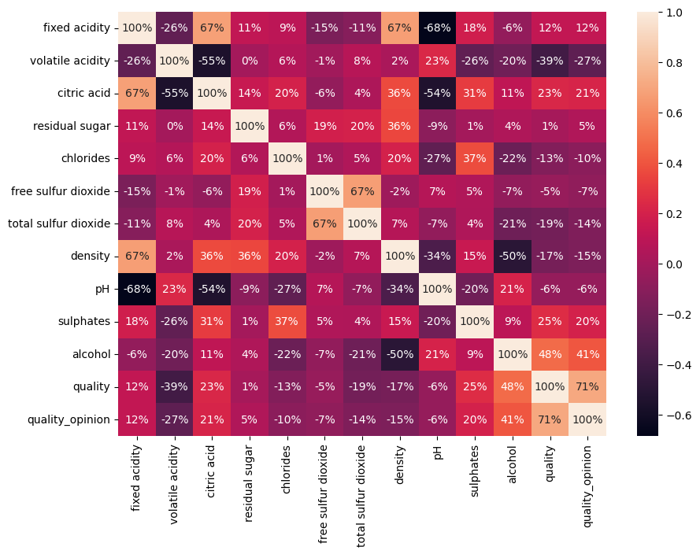

# 🍷 Classificador da Qualidade do Vinho Tinto com Rede Neural MLP 

  

Este projeto consiste em investigar diferentes configurações de uma rede MLP(Multi Layer Perceptron) para resolver o 
problema [Red Wine Quality](https://www.kaggle.com/datasets/uciml/red-wine-quality-cortez-et-al-2009). Desse modo, esse dataset deve ser tratado como um problema 
para previsão da qualidade do vinho com base nos outros 11 atributos do dataset [winequality-red.csv](https://github.com/AlessandroVasconcelos/Classificador-da-Qualidade-do-Vinho-Tinto-com-Rede-MLP/blob/main/winequality-red.csv). Os 
parâmetros investigados foram:
- Taxa de aprendizagem;
- Quantidade de neurônios por camada;
- Quantidade de camadas;
- Função de perda.

## 💡 Solução
Portanto, foi utilizado uma classificação binária do conjunto de dados do vinho tinto usando um perceptron multicamada baseado em 11 características e com qualidade, rotulada como **'quality_opinion'**, como variável alvo. Aliado a isso, foi aplicado um **balanceamento de dados**, uma vez que o conjunto original apresenta desbalanceamento entre as classes. Essa etapa foi fundamental para melhorar a capacidade do modelo em identificar corretamente vinhos de alta qualidade. 
- [Red-Wine-Quality-Classifier-with-MLP-Neural-Network.ipynb](https://github.com/AlessandroVasconcelos/Classificador-da-Qualidade-do-Vinho-Tinto-com-Rede-MLP/blob/main/Red_Wine_Quality_Classifier_with_MLP_Neural_Network.ipynb)

## 📊 Resultados e Visualizações

Após testar diferentes arquiteturas, o modelo que apresentou a melhor capacidade de generalização e menor *overfitting* foi a **Configuração 2** (2 camadas ocultas com 20 e 10 neurônios, taxa de aprendizado 0.01, ativação 'relu').

Abaixo estão os gráficos que detalham o desempenho do classificador e a análise de correlação das características do vinho:

| Matriz de Confusão (Melhor Modelo) | Mapa de Calor (Correlação de Atributos) |
| :---: | :---: |
|  |  |

A partir da análise das visualizações geradas pelo melhor modelo, podemos concluir que:

* **Comportamento do Modelo (Matriz de Confusão):** A rede neural apresentou 228 Verdadeiros Negativos (VN), classificando corretamente vinhos de baixa qualidade (classe Baixa). Foram observados 45 Falsos Positivos (FP), onde vinhos de baixa qualidade foram erroneamente classificados como de alta, 9 Falsos Negativos (FN), indicando casos em que o modelo não identificou vinhos de alta qualidade, e 38 Verdadeiros Positivos (VP), representando os acertos na classe de vinhos de alta qualidade (classe Alta).

* **A Química da Qualidade (Mapa de Calor):** A análise de correlação revelou que o **Teor Alcoólico (alcohol)** é o fator isolado que mais influencia positivamente (41%) a nota do vinho, seguido pelos níveis de sulfatos. Em contrapartida, a **Acidez Volátil (volatile acidity)** é o atributo que mais derruba a qualidade (-27%), pois em altos níveis confere ao vinho um indesejado sabor de vinagre.

Dessa forma, a topologia da rede MLP conseguiu capturar com sucesso não apenas os padrões matemáticos, mas também as regras químicas fundamentais que definem um bom vinho tinto.

## 👨‍🏫 Professor/Orientador:
Gilzamir Ferreira Gomes.

## 🛠️ Ferramentas Utilizadas:
- 

- 

<!--
-  
-->

